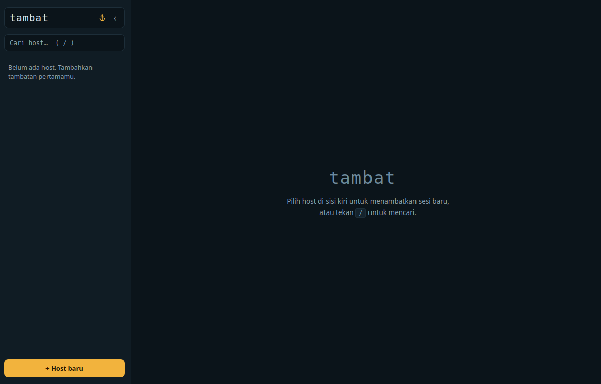
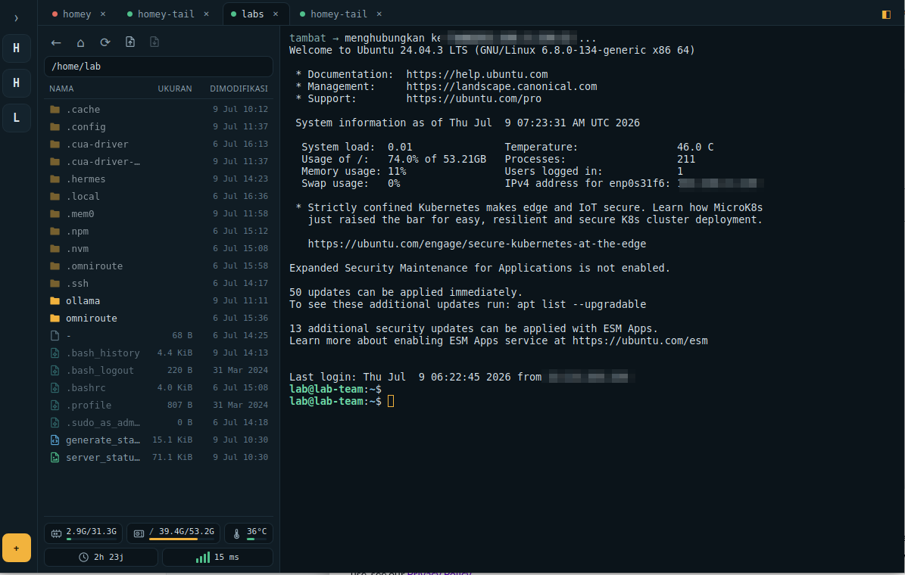

# ⚓ Tambat

**SSH client desktop yang ringan, aman, dan enak dipakai** — terminal, file
manager (SFTP), dan monitor server jadi satu, berdampingan di tiap tab.
Alternatif **gratis & open-source** untuk Termius/MobaXterm.

Dibangun dengan **Tauri 2** (Rust + `ssh2`) dan **React + xterm.js** — memakai
WebView bawaan sistem (bukan Chromium tersemat), jadi binarinya hanya ~7 MB.

*Tambat* (bahasa Indonesia): menambatkan — seperti kapal yang ditambatkan ke dermaga. 🪢


## Tampilan

| Sebelum connect | Sesudah connect |
| :---: | :---: |
|  |  |

## ⚓ Filosofi nama

Dalam pelayaran, **menambatkan** adalah mengikat kapal ke dermaga dengan tali —
menahannya tetap di tempat di tengah arus, aman dan siap dimuati. Sebuah sesi
SSH pada dasarnya sama: Anda melempar tali ke server nun jauh, mengikatnya erat,
lalu bekerja dari geladak sendiri seolah kapal dan dermaga menyatu.

Setiap **host** adalah dermaga. Setiap **tab** adalah satu tali tambat. Aksen
**amber** di seluruh aplikasi adalah *lampu dermaga* yang menuntun kapal pulang
di malam hari. Maka namanya **Tambat** — bukan sekadar "menyambung", tetapi
menautkan diri dengan mantap ke sisi seberang, selama Anda membutuhkannya.

## ✨ Kenapa Tambat?

- **Satu jendela, semua yang Anda butuh** — terminal berwarna penuh, file
  browser SFTP, dan statistik server (RAM · disk · suhu · baterai · ping)
  berdampingan di setiap tab.
- **Aman sejak awal** — password & passphrase disimpan di **keyring sistem**
  OS, tidak pernah ditulis ke file biasa.
- **Alur kerja cepat** — cari host dengan `/`, connect satu klik, sidebar
  otomatis menciut jadi rail saat sesi mulai, dan panel file mengikuti `cd`
  Anda di terminal secara live.
- **Terasa seperti desktop** — jelajah file berkolom (Nama/Ukuran/Dimodifikasi),
  dobel-klik untuk buka, dan drag-and-drop file dari OS untuk mengunggah.

## Fitur

**Koneksi & terminal**
- Session manager: simpan host (label, alamat, port, user), cari kilat dengan `/`
- Autentikasi password, private key (+passphrase), dan SSH agent
- Terminal penuh via xterm.js (xterm-256color, scrollback 8000 baris, klik URL)
- Multi-tab dengan indikator status koneksi live, tutup tab `Ctrl+Shift+W`
- Sidebar host bisa menciut jadi rail sempit — otomatis saat sesi pertama,
  tetap satu klik untuk menyambung

**File & SFTP (panel per tab)**
- Jelajah folder dengan tampilan kolom Nama / Ukuran / Dimodifikasi
- Dobel-klik buka file dengan aplikasi default; salin, pindah, ganti nama,
  hapus, dan buat folder di server
- **Unggah**: tombol toolbar (pilih file) atau drag-and-drop langsung dari
  file manager OS
- **Unduh** file terpilih ke folder Unduhan
- Panel otomatis mengikuti direktori kerja terminal (via OSC 7)

**Monitor & keamanan**
- Statistik server live: RAM, disk per partisi, suhu CPU, baterai, ping ke 1.1.1.1/8.8.8.8
- Secret per host: tanya tiap kali · ingat selama app berjalan · atau simpan
  permanen di **keyring sistem** (Secret Service / Keychain / Credential Manager)
- Daftar host tersimpan sebagai JSON di direktori data app
  (Linux: `~/.local/share/app.tambat.desktop/hosts.json`)

## Prasyarat build

**Linux (Debian/Ubuntu):**

```bash
sudo apt install libwebkit2gtk-4.1-dev build-essential curl wget file \
  libxdo-dev libssl-dev libayatana-appindicator3-dev librsvg2-dev pkg-config
```

**Rust** (butuh 1.77.2+ untuk Tauri 2):

```bash
curl --proto '=https' --tlsv1.2 -sSf https://sh.rustup.rs | sh
```

**Node.js** 18+ (untuk frontend).

Untuk target Windows/macOS, lihat prasyarat resmi Tauri:
https://tauri.app/start/prerequisites/

## Menjalankan

```bash
npm install
npm run tauri dev      # mode pengembangan (hot reload)
npm run tauri build    # build rilis: .deb, .rpm, dan AppImage di src-tauri/target/release/bundle/
```

Build pertama mengompilasi banyak crate Rust — bisa beberapa menit. Build
berikutnya jauh lebih cepat.

## Arsitektur singkat

```
Frontend (React + TS)                Backend (Rust)
┌─────────────────────┐   invoke    ┌──────────────────────────┐
│ App / Sidebar / Tab │ ──────────► │ ssh_connect / send /     │
│ TermView (xterm.js) │             │ resize / disconnect      │
│                     │ ◄────────── │ hosts_list / save / del  │
└─────────────────────┘   event     └──────────────────────────┘
                       ssh-data-{id}      │ satu thread IO per koneksi
                       ssh-exit-{id}      ▼
                                    ssh2 (libssh2) → server
```

- Setiap koneksi berjalan di thread sendiri dengan session non-blocking:
  membaca output server → dikirim ke frontend sebagai event base64;
  input keyboard / resize / disconnect masuk lewat kanal `mpsc`.
- `src-tauri/src/ssh.rs` — seluruh logika SSH terminal.
- `src-tauri/src/panel.rs` — sesi SSH kedua per tab untuk file browser (SFTP)
  dan statistik server, agar tidak mengganggu aliran data terminal.
- `src-tauri/src/secrets.rs` — simpan/baca password di keyring sistem.
- `src-tauri/src/hosts.rs` — CRUD daftar host (JSON).
- `src/components/TermView.tsx` — siklus hidup terminal per tab.
- `src/components/FilePanel.tsx` — file browser + statistik server.

## Test

```bash
cd src-tauri
cargo test                    # test unit (parsing statistik, dll.)

# Test E2E butuh mock sshd (paramiko) di 127.0.0.1:2222 + Secret Service aktif:
python3 tests/mock_sshd.py &
cargo test -- --ignored
```

## Roadmap

1. **Verifikasi host key** — host key server belum diverifikasi (known_hosts).
   Tambahkan `sess.known_hosts()` + dialog konfirmasi fingerprint sebelum
   dipakai di jaringan yang tidak dipercaya.
2. Split pane, snippet/command palette, port forwarding UI, jump host,
   grup/folder host, dan tema terang.

## Lisensi

[MIT](LICENSE)
